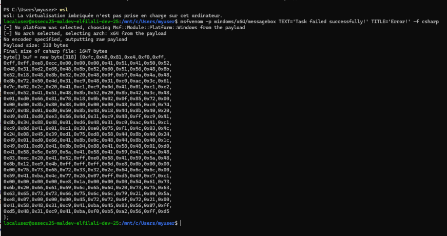
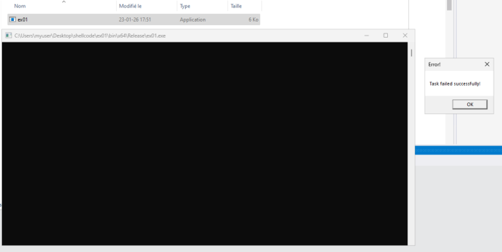
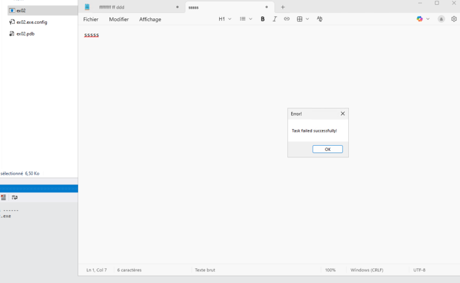
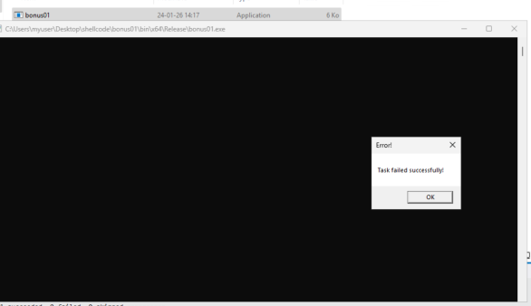
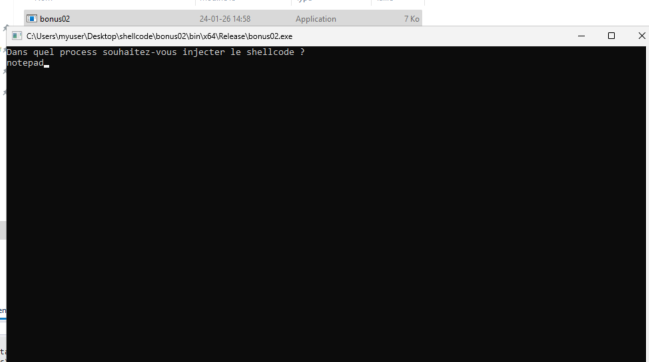
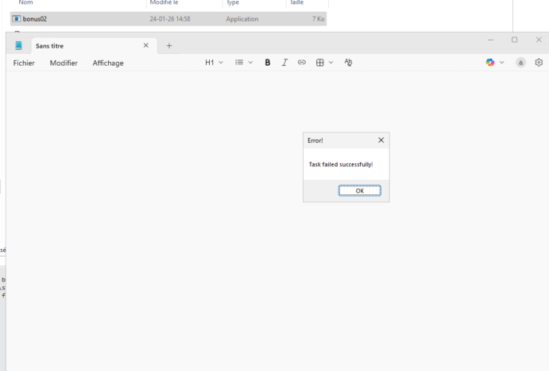

Yassine EL FILALI (yelfilal)

24/01/2026

# Activité : Développement de Malware

## 1. Introduction
Ce laboratoire a pour objectif d'explorer les mécanismes utilisés par les "malware" pour s'exécuter et s'introduire sur un système Windows. L’idée est de comprendre concrètement comment un attaquant manipule la mémoire et les processus, afin de mieux appréhender les mécanismes de défense et de détection.

## 2. Exercice 0 : Environnement de travail

### Objectif
Mettre en place un environnement pour la génération de payload, développement, exécution du malware dans des conditions contrôlées.

### Architecture mise en place
- **Machine attaquante :** WSL  
  - Outil : `msfvenom` pour la génération du payload.
- **Machine de développement :** Windows 11.
- **Machine de test :** Windows 11 (Antivirus désactivé).
- **IDE :** Visual Studio 2019.
- **Langage :** C# (.NET Framework 4.7.2).

### Génération du shellcode
Le shellcode a été généré pour l'architecture x64, afin d'afficher une MessageBox.  
Commande utilisée :

```bash
msfvenom -p windows/x64/messagebox TEXT='Task failed successfully!' TITLE='Error!' -f csharp
```



## 3. Exercice 1 : Loader

### 3.1. Objectif
Créer un programme capable :
- d’allouer de la mémoire,  
- d’y copier un shellcode,  
- puis de l’exécuter.

### 3.2. Implémentation technique
Le programme utilise **P/Invoke** pour importer des fonctions de l’API Windows via **kernel32.dll**.  
Flux d’exécution :

1. **Allocation :** On appel `VirtualAlloc` pour allouer une zone mémoire avec les permissions `EXECUTE_READWRITE`.  
2. **Copie :** `Marshal.Copy` transfère le shellcode vers la zone mémoire allouée.  
3. **Exécution :** `CreateThread` lance un nouveau thread qui pointe vers l’adresse du shellcode.  
4. **Attente :** `WaitForSingleObject` évite que le programme se ferme (ce qui tuerait le thread).

### 3.3. Difficultés rencontrées et résolution
- **Problème :** Lors des premiers essais, le programme plantait.  
- **Analyse :** Visual Studio compile par défaut en mode **Any CPU**, alors que le shellcode généré par msfvenom était du **x64**.  
- **Résolution :** Configuration de la solution en **x64** via le Gestionnaire de configuration de Visual Studio.

### 3.4. Exécution
> 

## 4. Exercice 2 : Process Injection

### 4.1. Objectif
Injecter le shellcode dans un processus tiers ici `notepad`.  
Le but est de cacher le shellcode en le faisant tourner “sous l’identité” d’un programme réel.

### 4.2. Implémentation technique
On manipule la mémoire d’un autre processus.  
Flux d’exécution :

1. **Cible :** `Process.GetProcessesByName("notepad")` pour récupérer l’ID du processus cible.  
2. **Ouverture :** `OpenProcess` pour obtenir un **handle** avec les droits nécessaires.  
3. **Allocation dans le processus distant :** `VirtualAllocEx` pour allouer de la mémoire dans le processus cible.  
4. **Écriture :** `WriteProcessMemory` pour copier le shellcode depuis l’injecteur vers le processus cible.  
5. **Exécution :** `CreateRemoteThread` pour démarrer l’exécution du shellcode dans le processus cible.

### 4.3. Observations
Une fois l’injection réalisée, l’injecteur se termine, mais le payload continue de s’exécuter dans `notepad.exe`.  
Dans le Gestionnaire des tâches, on voit “Notepad”, alors que c’est un code injecté qui tourne dedans.

### 4.4. Exécution
> 

## 5. Exercice 3 : Évasion et Obfuscation

### 5.1. Objectif
Contourner la détection antivirus.  
Dans les exercices précédents, le shellcode était encodé en clair, ce qui le rend facilement détectable.

### 5.2. Implémentation technique
La stratégie choisie est composé de deux transformations :
- **XOR :** applique un masque avec une clé pour rendre le shellcode moins reconnaissable.  
- **Base64 :** transforme le résultat binaire en une chaîne ASCII.

J’ai développé une classe utilitaire contenant deux méthodes : chiffrement et déchiffrement.

Flux d’exécution :
1. **Chiffrement :** On initialise une propriété avec le shellcode chiffré.  
2. **Cible :** `Process.GetProcessesByName("notepad")` pour récupérer l’ID du processus cible.  
3. **Ouverture :** `OpenProcess` pour obtenir un **handle** avec les droits nécessaires.  
4. **Déchiffrement :** déchiffre le shellcode chiffré pour pouvoir l’utiliser.  
5. **Allocation dans le processus distant :** `VirtualAllocEx` pour allouer de la mémoire dans le processus cible.  
6. **Écriture :** `WriteProcessMemory` pour copier le shellcode depuis l’injecteur vers le processus cible. 
7. **Exécution :** `CreateRemoteThread` pour démarrer l’exécution du shellcode dans le processus cible.

### 5.3. Observations
Une fois l’injection réalisée, l’injecteur se termine, mais le payload continue de s’exécuter dans `notepad.exe`.  
Dans le Gestionnaire des tâches, on voit “Notepad”, alors que c’est un code injecté qui tourne dedans.

### 5.4. Exécution
> 

## 6. Bonus 1 : Exécution du Loader sans CreateThread

### 6.1. Objectif
L'utilisation de `CreateThread` est surveillé par les antivirus et détectable.  
Le but est d'exécuter le shellcode dans le processus courant sans créer un nouveau thread.

### 6.2. Implémentation technique
Au lieu d’utiliser l’API Windows pour gérer l’exécution, j’ai utilisé une solution le **Marshaling Delegate** qui est inclus dans C#/.NET . `Marshal.GetDelegateForFunctionPointer` permet de convertir shellcode alloué via `VirtualAlloc` en une fonction appelable. Le code ne nécessite plus l’importation de `CreateThread`.

### 6.3. Exécution
> 

## 7. Bonus 2 : Process Injection autonome

### 7.1. Objectif
Dans l’Exercice 2, on suppose que `notepad` est déjà lancé. Si la cible est absente, le programme s’arrête.

Le but est de rendre l’injecteur autonome :
- vérifier la présence du processus cible,
- le démarrer s’il est absent.

### 7.2. Implémentation technique
Ajout d’une vérification conditionnelle avant l’ouverture du handle :

1. **Recherche :** tentative de récupération du processus via `Process.GetProcessesByName`.  
2. **Condition :**
   - **Si trouvé :** on utilise le PID existant.  
   - **Si non trouvé :** on instancie un nouvel objet `Process`, on configure le nom du fichier exécutable, et on le démarre via `.Start()`.  
3. **Ouverture :** `OpenProcess` pour obtenir un **handle** avec les droits nécessaires.  
4. **Allocation dans le processus distant :** `VirtualAllocEx` pour allouer de la mémoire dans le processus cible.  
5. **Écriture :** `WriteProcessMemory` pour copier le shellcode depuis l’injecteur vers le processus cible. 
6. **Exécution :** `CreateRemoteThread` pour démarrer l’exécution du shellcode dans le processus cible.

### 7.3. Exécution
> 

> 

## 8. Bonus 3 :
